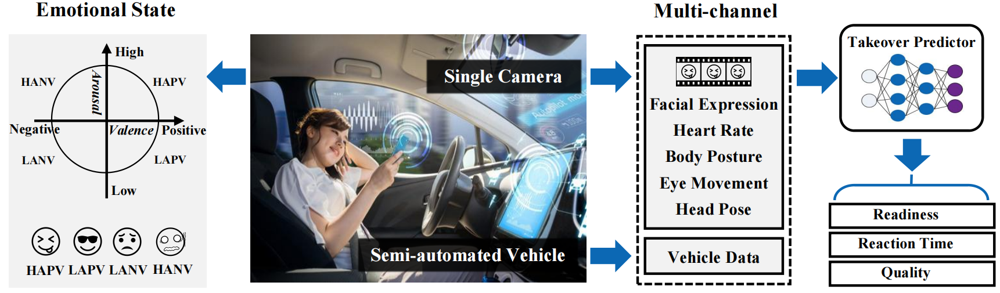

# Multi-TPER
Multi-task Learning Framework with Multimodal Signal for Takeover Prediction and Emotion Regulation

## Introduction

**EmoTake** is a deep learning-empowered system that explores drivers’ emotional and physical states to predict takeover readiness, reaction time, and quality.



## Running
The dataset used in this project comes from [EmoTake](https://github.com/yibingweng/EmoTake).

## Citation

If you find this work helpful, please consider citing the following papers.

```
@article{gu2024emotake,
  title={EmoTake: Exploring Drivers' Emotion for Takeover Behavior Prediction},
  author={Gu, Yu and Weng, Yibing and Wang, Yantong and Wang, Meng and Zhuang, Guohang and Huang, Jinyang and Peng, Xiaolan and Luo, Liang and Ren, Fuji},
  journal={IEEE Transactions on Affective Computing},
  year={2024},
  publisher={IEEE}
}
```

## Concact

If you have any questions or want to use the code, feel free to contact:

+ Yu Gu: (yugu.bruce@ieee.org)
+ Xinyu Feng: (22032202005@mails.guet.edu.cn)
